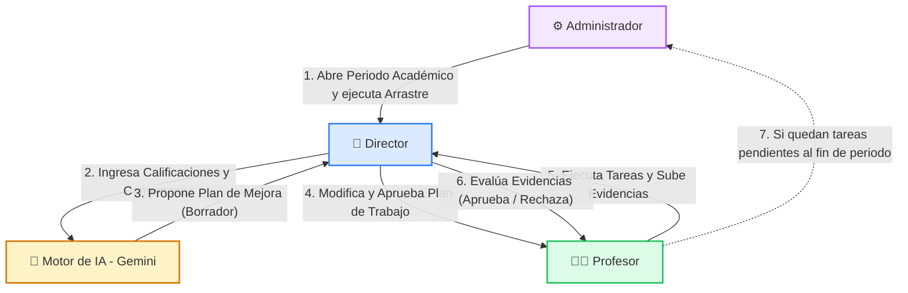

# Guía Rápida: Relación de Roles
## Sistema de Gestión de Planes de Mejora Profesoral con IA · Universidad Simón Bolívar

Esta guía rápida explica de manera visual y directa cómo interactúan los tres roles del sistema (Administrador, Director y Profesor) y proporciona un mapa claro de la función exacta de cada botón en la plataforma.

---

## 🔄 1. Conexión y Flujo entre los Tres Roles

El sistema no es un conjunto de herramientas aisladas; es un **ciclo colaborativo cerrado** donde las acciones de un rol impactan directamente a los demás.

### Diagrama de Interacción (Ciclo del Periodo)

### Paso a Paso: ¿Cómo se conectan?

1. **La Preparación (ADMINISTRADOR → DIRECTOR y PROFESOR):**
   * El Administrador abre un nuevo semestre académico. En ese instante, el sistema busca deudas históricas: si un profesor tenía tareas sin completar en el semestre anterior, el sistema las arrastra (**Carry-Over**) y las asigna automáticamente en el nuevo periodo. Además, asigna tareas comunes de la institución.
2. **El Diagnóstico (DIRECTOR → IA):**
   * El Director evalúa a los profesores de su departamento, ingresando notas y comentarios detallados sobre sus puntos débiles en clase. La Inteligencia Artificial (Gemini) lee estos comentarios para idear una estrategia de mejora.
3. **El Plan (DIRECTOR + IA → PROFESOR):**
   * La IA propone tareas concretas. El Director las revisa (para verificar que sean coherentes), las edita si es necesario y **Aprueba el Plan**. Solo hasta este momento el Profesor puede ver el plan en su pantalla.
4. **La Ejecución (PROFESOR → DIRECTOR):**
   * El Profesor trabaja en sus tareas. Al terminarlas, sube un soporte (documento o enlace) que le llega a la bandeja de entrada del Director para su revisión.
5. **El Cierre de Ciclo (DIRECTOR → PROFESOR):**
   * El Director aprueba (sube el avance del docente) o rechaza (el docente debe volver a enviar con correcciones). Si al finalizar el semestre alguna tarea queda pendiente, el ciclo se repite en el paso 1.

---

## ⚙️ 2. Diccionario de Botones: ¿Para qué funciona cada botón?

A continuación se detalla cada botón del sistema, agrupado por el rol que lo utiliza, indicando su propósito e impacto.

### 2.1 Panel del Administrador (⚙️ Gestión de Infraestructura)

| Pantalla / Vista | Botón / Acción | ¿Para qué sirve? (Propósito) | ¿Qué hace en el fondo? (Lógica) | ¿Cómo impacta a los otros roles? |
| :--- | :--- | :--- | :--- | :--- |
| **Dashboard** | `Ajustar Periodos` | Acceso rápido a periodos. | Redirecciona a la ruta `/admin/periodos`. | Ninguno directo. |
| **Dashboard** | `Sincronizar Áreas` | Acceso rápido a categorías de mejora. | Redirecciona a la ruta `/admin/areas`. | Ninguno directo. |
| **Dashboard** | `Carga Masiva Usuarios` | Acceso rápido a gestión de cuentas. | Redirecciona a la ruta `/admin/usuarios`. | Ninguno directo. |
| **Gestión de Periodos** | `Registrar Periodo` | Crear un nuevo semestre (ej. `2026-1`). | Guarda el periodo en la BD en estado "inactivo". | El periodo queda guardado para su posterior activación. |
| **Gestión de Periodos** | `Aperturar` (icono Play) | **BOTÓN CLAVE:** Activar el semestre actual de trabajo. | Desactiva semestres anteriores, activa el nuevo y clona tareas pendientes (Carry-Over). | Los **Directores** pueden evaluar en este nuevo periodo. Los **Profesores** reciben sus deudas anteriores en rojo. |
| **Gestión de Periodos** | `Editar` (icono Lápiz) | Cambiar fechas o nombre de un periodo. | Habilita la edición en línea en la fila. | Actualiza los datos mostrados. |
| **Gestión de Periodos** | `Guardar` (icono Disquete) | Confirmar cambios de edición de periodo. | Envía una petición `PUT` al backend. | Cambia los nombres/fechas del periodo permanentemente. |
| **Gestión de Áreas** | `Crear Área` | Registrar una nueva área de evaluación (ej: *TIC*). | Inserta la categoría en la tabla `areas`. | Los **Directores** e **IA** podrán clasificar tareas de mejora en esta categoría. |
| **Gestión de Departamentos** | `Crear Departamento` | Registrar una facultad (ej: *Ing. Sistemas*). | Inserta el departamento en la tabla `programas`. | Permite agrupar usuarios y cursos bajo este departamento. |
| **Gestión de Cursos** | `Crear Curso` | Cargar una materia (ej: *Base de Datos I*). | Guarda la materia en la tabla `cursos`. | Permite a los **Directores** calificar al docente en esa materia específica. |
| **Gestión de Roles** | `Admin / Director / Profesor` | Cambiar permisos de una persona. | Modifica el campo `role` del usuario en la base de datos. | Cambia de inmediato las opciones del menú lateral que ve ese usuario al iniciar sesión. |

---

### 2.2 Panel del Director (👔 Gestión y Evaluación de Docentes)

| Pantalla / Vista | Botón / Acción | ¿Para qué sirve? (Propósito) | ¿Qué hace en el fondo? (Lógica) | ¿Cómo impacta a los otros roles? |
| :--- | :--- | :--- | :--- | :--- |
| **Ingreso de Evaluación** | `Guardar Evaluación` | Registrar la calificación de un docente. | Guarda notas y llama a la IA para analizar comentarios. | Insumo listo para generar el Plan de Mejora. |
| **Generación de Planes con IA** | `Checkbox Cabecera` | Seleccionar a todos los profesores. | Marca las casillas de todos los profesores pendientes. | Agiliza el trabajo masivo. |
| **Generación de Planes con IA** | `Generar Planes para Seleccionados` | **BOTÓN CLAVE:** Crear borradores de planes con IA. | Consulta a la API de Google Gemini en lotes y guarda borradores. | Genera un plan preliminar (aún oculto para el profesor). |
| **Gestión de Planes** | `Ver Detalle / Editar` | Entrar a auditar las tareas propuestas por la IA. | Abre el visor interactivo de tareas del profesor. | Permite refinar el plan propuesto antes de publicarlo. |
| **Detalle del Plan** | `Editar Tarea` | Cambiar textos o plazos de una tarea propuesta. | Abre campos editables de descripción, producto y fecha. | Ajusta las exigencias a la realidad del docente. |
| **Detalle del Plan** | `Eliminar Tarea` (Papelera) | Quitar una tarea que no aplica. | Elimina el registro de la tarea de la base de datos. | El docente no tendrá que hacer esta actividad. |
| **Detalle del Plan** | `Agregar Tarea Manual` | Añadir una tarea extra sin usar la IA. | Abre un formulario modal vacío para registrar una tarea. | El docente tendrá esta actividad en su plan. |
| **Detalle del Plan** | `Aprobar Plan` | **BOTÓN CLAVE:** Hacer público el plan del profesor. | Cambia el estado del plan de `Borrador` a `Aprobado`. | El **Profesor** ya puede ver el plan en su pantalla y empezar a subir evidencias. |
| **Bandeja de Evidencias** | `Ver Archivo / Abrir Link` | Inspeccionar la evidencia enviada. | Abre el archivo PDF o link en una pestaña del navegador. | Permite calificar si el docente cumplió o no. |
| **Bandeja de Evidencias** | `Aprobar Evidencia` (Check) | Validar el cumplimiento de la tarea. | Cambia el estado de la tarea a *Aprobada/Verificada*. | Sube el porcentaje de progreso general del **Profesor**. |
| **Bandeja de Evidencias** | `Rechazar Evidencia` (X) | Devolver la tarea por estar incompleta/incorrecta. | Cambia el estado a *Rechazada* e inyecta la retroalimentación. | El **Profesor** verá la tarea con estado "Rechazada", con la nota del porqué, y el botón para volver a subirla. |
| **Exportar Reportes** | `Exportar PDF` | Obtener el soporte impreso oficial. | Genera y descarga un PDF membretado vía Laravel DomPDF. | Sirve como documento probatorio físico. |

---

### 2.3 Panel del Profesor (👨‍🏫 Ejecución de Mejoras)

| Pantalla / Vista | Botón / Acción | ¿Para qué sirve? (Propósito) | ¿Qué hace en el fondo? (Lógica) | ¿Cómo impacta al Director / Sistema? |
| :--- | :--- | :--- | :--- | :--- |
| **Dashboard Profesor** | `Subir Evidencia` | Iniciar el envío de pruebas de una tarea. | Abre un modal para cargar archivos o escribir un enlace. | Permite responder a la tarea asignada. |
| **Modal Subir Evidencia** | `Enviar Evidencia` | **BOTÓN CLAVE:** Mandar el soporte a revisión. | Sube el archivo al servidor (`Storage`) y pone la tarea en *En Revisión*. | La entrega desaparece del dashboard del Profesor y aparece en la Bandeja de Evidencias del **Director**. |
| **Modal Subir Evidencia** | `Cancelar` | Salir del formulario sin guardar nada. | Cierra la ventana emergente y limpia el formulario. | No se realiza ningún cambio. |

---

## 💡 3. Resumen Práctico: El Ciclo de una Tarea

Para ver la conexión total, sigamos el viaje de una sola tarea:

1. **Apertura:** El **Administrador** da clic en `Aperturar` periodo `2026-1`.
2. **Evaluación:** El **Director** evalúa al profesor Pérez, escribe en comentarios cualitativos: *"El docente no usa Moodle"*, y da clic en `Guardar Evaluación`.
3. **Propuesta IA:** El **Director** da clic en `Generar Planes`. La IA lee el comentario y crea una tarea: *"Realizar curso de Moodle"* con entregable *"Certificado en PDF"*.
4. **Validación:** El **Director** revisa las tareas propuestas, decide que está bien y presiona `Aprobar Plan`.
5. **Acción Docente:** El **Profesor** Pérez entra a su cuenta, ve la tarea en su dashboard, realiza el curso, da clic en `Subir Evidencia`, adjunta el PDF del certificado y hace clic en `Enviar Evidencia`.
6. **Auditoría Final:** El **Director** recibe la alerta en su bandeja, hace clic en `Ver Archivo` (comprueba el PDF del curso Moodle) y hace clic en `Aprobar Evidencia`. La tarea finaliza en estado **Verificada (100% de progreso)**.
